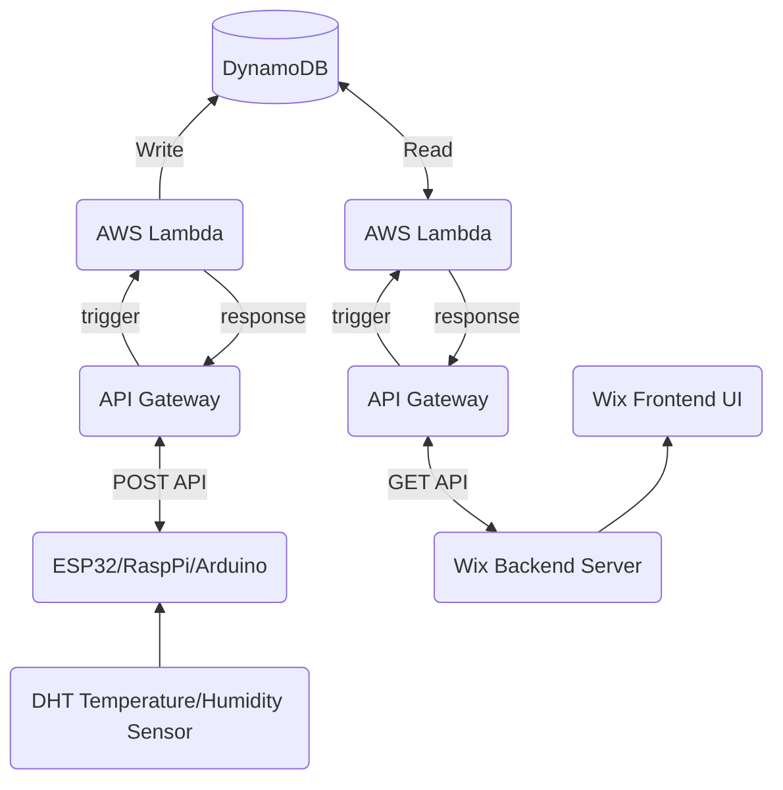

```mermaid
flowchart BT;
    envt(DHT Temperature/Humidity Sensor)-->dev(ESP32/RaspPi/Arduino);
    dev<-->|POST API|gw1(API Gateway);
    gw1-->|trigger|lmd1(AWS Lambda)
    lmd1-->|response|gw1;
    lmd1-->|Write|DB[(DynamoDB)];
    backend(Wix Backend Server)<-->|GET API|gw2(API Gateway);
    gw2-->|trigger|lmd2(AWS Lambda);
    lmd2-->|response|gw2;
    lmd2<-->|Read|DB;
    backend-->frontend(Wix Frontend UI);
```
